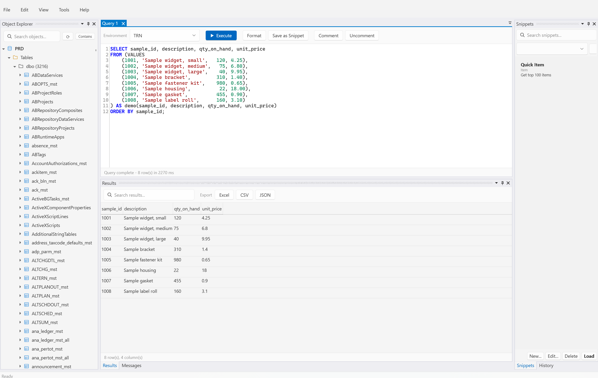
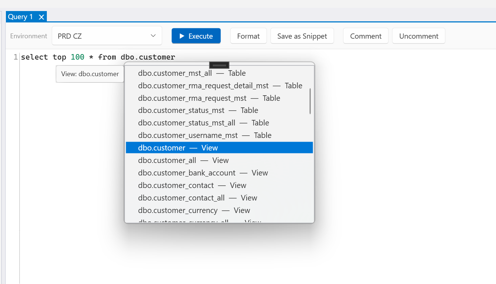
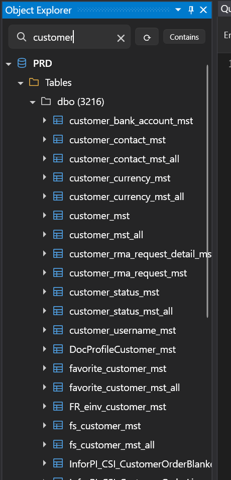
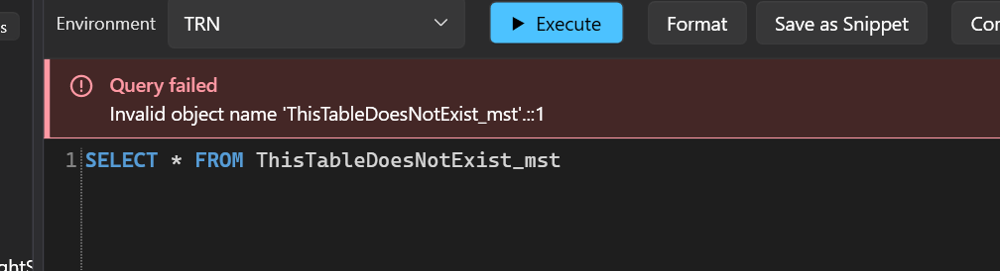
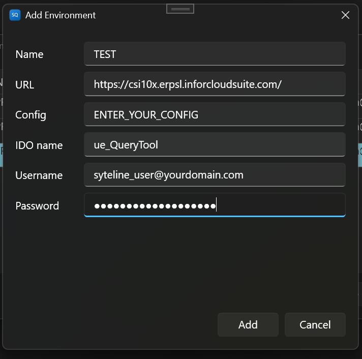

# SyteQuery

**A native Windows query tool for Infor SyteLine** — an SSMS-style workspace for exploring and querying your SyteLine database, built on SyteLine's own REST API.

<picture>
  <source media="(prefers-color-scheme: dark)" srcset="docs/images/hero-dark.png">
  
</picture>

Browse every table, view, stored procedure and function across your environments, write T-SQL with IntelliSense, run it, and export the results — without leaving a single window, and without the round trips through reports, forms and one-off scripts that ad-hoc SyteLine data work usually involves.

> **Status: early release (v0.1).** It is used day to day against real SyteLine environments, but it is young software. Read [Safety](#safety) before pointing it at production.

## Features

**Explore**
- **Object Explorer** for every configured environment: tables, views, stored procedures and functions grouped by schema, with columns, keys and triggers loaded as you expand. Search, refresh, and a background load of the object lists so folders open instantly.
- **Object actions**: view a stored procedure's, function's or trigger's definition; script a custom (`ue_`) table; quick-select the top 100 rows; or **compare a stored procedure across two environments** with a side-by-side diff.

**Query**
- **Multi-tab editor** (AvalonEdit) with T-SQL syntax highlighting, **IntelliSense as you type** (keywords, tables, views, procedures, functions, snippets, and columns after `table.`), format-query, and comment/uncomment.
- **Scripts with several statements**: run more than one `SELECT` (or a mix of statements) in one go, and use `GO` to split a script into batches.
- Query **analysis before it runs**, statement by statement: warns about missing `WHERE` (including `UPDATE` and `DELETE`), `SELECT *`, possible Cartesian products and more, and applies a `TOP 1000` limit to each `SELECT` where you haven't set one.
- **Failures are impossible to miss**: a red banner appears right above the editor with the SQL Server error.
- **Query history** (bounded, searchable) and **snippets** (save, organise, reload).

**Results**
- A native, **virtualized grid** that stays smooth on large result sets, with quick search across all columns and export to **Excel, CSV and JSON**.
- **Several result sets at once**: a command that returns more than one shows them as tabs above the grid. If a later statement fails, the earlier results stay visible under the error. Excel export writes every result set to its own sheet.

**Built for daily use**
- **Multiple environments**, each with its own credentials, switchable per query tab.
- Credentials are encrypted with Windows DPAPI (per user, per machine) — nothing is stored in plain text and no keys live in the app or its config.
- Windows 11 look with **light / dark / follow-Windows** themes, an installer, and in-app update checks.
- Everything is stored locally in a SQLite database under `%LOCALAPPDATA%\SyteQuery`. No account, no sign-in, no cloud service, no telemetry.

### Screenshots

**IntelliSense as you type** — tables, views, procedures, functions, snippets and columns, matched against the environment you're querying.

<picture>
  <source media="(prefers-color-scheme: dark)" srcset="docs/images/query-editor-dark.png">
  
</picture>

**Object Explorer** with search — folders open instantly because the object lists are loaded in the background.



**Failures are impossible to miss** — a red banner with the SQL Server error appears right above the editor.



## How it works

SyteQuery talks to SyteLine through Infor's documented **IDO REST v2 API** (`/IDORequestService/ido/...`) — no proprietary client libraries. It authenticates with the environment's own security token endpoint and calls IDO methods over HTTPS. Infor offers that token request in two forms — credentials in the URL, or in HTTP headers — and neither works in every environment (a gateway may block one, an older SyteLine may lack the other, and characters such as `\` or `/` in a user name or password can't travel in a URL). SyteQuery tries whichever is likely to work and falls back to the other, so you don't have to choose; if both fail, the error says what each one returned. A wrong password is never retried, so it can't count as two failed logins. If one environment only ever works one way — for example SyteLine answers the URL form with a plain "invalid credentials" even for a correct password, which Automatic can't tell apart from a wrong one — set **Sign-in** to *Credentials in HTTP headers* (or *in the URL*) under **Tools → Environments → Edit**; SyteQuery then uses exactly that form, once.

To run SQL it uses one small custom IDO that **you install once in each SyteLine environment**: its `ExecuteQuery` method runs the command SyteQuery sends and returns the rows as JSON. SyteQuery never installs anything on your server for you — the IDO's source, build steps and install instructions are in [`SyteQuery.IDO/`](SyteQuery.IDO/README.md), so you can read exactly what will run before you save it into SyteLine. When you add an environment you give SyteQuery the IDO's name, and it checks the IDO end to end (it runs a harmless `SELECT 1` through it) and tells you what to fix if anything is off.

Metadata (the object lists, columns, triggers) is read from SQL Server's catalog views through the same IDO and cached in memory per environment.

## Requirements

- Windows 10 or 11 (x64)
- An Infor SyteLine / CloudSuite Industrial environment with the IDO REST service reachable from your PC
- A SyteLine user with permission to call IDOs, and the query IDO compiled and installed in the environment (assembly in the IDO Extension Class Assemblies form, bound to a new IDO) — see [`SyteQuery.IDO/README.md`](SyteQuery.IDO/README.md)

## Install

> **Prerequisite — set up the query IDO first.** SyteQuery can't connect to an environment until its query IDO has been compiled and installed in SyteLine (see [Setting up an environment](#setting-up-an-environment) below). Installing the app alone isn't enough: adding an environment fails its connection check until the IDO exists.

There is no pre-built installer yet — SyteQuery is pre-release. For now, [build it from source](#build-from-source) and run it, or build the installer yourself with `./build/Build-Installer.ps1`, which produces `ClearDay.SyteQuery-win-Setup.exe` under `artifacts/releases/`. The installer installs per user (no administrator rights needed) and includes the .NET runtime. It isn't code-signed, so Windows SmartScreen may show an "unknown publisher" warning — choose *More info → Run anyway*.

### Setting up an environment

**This is a prerequisite:** the query IDO must be installed in an environment before you can add that environment in SyteQuery or run any query against it. It is a one-time step per environment that follows the standard SyteLine administration process: compile the `SyteQuery.IDO` project, upload the resulting **DLL and PDB** in the **IDO Extension Class Assemblies** form, create a new IDO, bind the assembly to it, and add the `ExecuteQuery` IDO method. The full walkthrough is in [`SyteQuery.IDO/README.md`](SyteQuery.IDO/README.md). Then: **Tools → Environments → Add**, enter your environment's URL (just the scheme and host, e.g. `https://csi10x.erpsl.inforcloudsuite.com`), the SyteLine **configuration** name, the **IDO name** you created, and your credentials. SyteQuery tests the connection and the IDO before saving.



## Build from source

Requires the [.NET 9 SDK](https://dotnet.microsoft.com/download/dotnet/9.0) on Windows.

```powershell
git clone https://github.com/ClearDayTechGroup/SyteQuery.git
cd SyteQuery
dotnet build SyteQuery.Desktop
dotnet run --project SyteQuery.Desktop
```

Build `SyteQuery.Desktop`, not the whole solution: the solution also contains the SyteLine-side IDO project, which needs Infor's assemblies (see [`SyteQuery.IDO/README.md`](SyteQuery.IDO/README.md)). Run the tests with `dotnet test SyteQuery.Tests`.

To build the installer: `./build/Build-Installer.ps1 -Version 0.1.0`. See [CONTRIBUTING.md](CONTRIBUTING.md) for the project layout and workflow.

## Safety

SyteQuery runs the SQL you type, with the permissions of the SyteLine account you connect with.

- It **blocks** `CREATE` / `ALTER` / `DROP` of procedures, views, functions and triggers (other than `extgen` procedures), and applies a row limit to unbounded `SELECT`s.
- It does **not** stop `INSERT`, `UPDATE` or `DELETE` statements — if the account can change data, so can your query. **Use a read-only account** for exploration, and be especially careful with production.
- Always review a query before pressing Execute (F5).

Found a security problem? Please follow [SECURITY.md](SECURITY.md).

## Known limitations

SyteQuery sends your SQL to SyteLine through the query IDO over REST, and that shapes what it can do today:

- **Several result sets need the updated IDO.** The first version of the query IDO returned only the first result set of a command, although every statement still ran. SyteQuery works with that older IDO, and tells you when it is hiding results; install the current IDO ([`SyteQuery.IDO/README.md`](SyteQuery.IDO/README.md)) to see them all. Update SyteQuery and the IDO together.
- **`GO` batches run separately.** Each batch is its own call to SyteLine, so temp tables and variables don't carry over from one batch to the next, unlike in SSMS. A script without `GO` is a single batch, and runs on one database connection.
- **No open transactions across runs.** You can't `BEGIN TRAN`, leave it open while you run sanity-check queries, and then `COMMIT` or `ROLLBACK` in a later run. SyteQuery has no access to the SQL Server session (SPID) its command runs in, so it can't keep a session — and therefore a transaction — alive between runs. Every run starts from a clean session. What you can do is put the whole sequence in one command, such as `BEGIN TRAN; UPDATE …; SELECT <your check>; ROLLBACK;`: with the current IDO you see the check's result set, then decide whether to run it again with `COMMIT`. That relies on how SyteLine handles the connection, so try it in a test environment first.

Something else getting in your way? See [Roadmap](#roadmap) below, and add your use case to a matching [feature request](../../issues?q=is%3Aissue+label%3Aenhancement).

## Roadmap

SyteQuery is a single-user desktop app today. Under consideration, in no fixed order:

- **Transactions held open across runs** — begin, check, then commit in a later run. Needs a way to keep one database session alive between runs, which the query IDO can't do today.
- **A shared server mode** — a small service plus the desktop client, so a team can share environments, snippets and history, with per-user permissions.
- **Scheduled jobs** — run a saved query on a schedule and deliver the results by email or webhook. This belongs in that server mode (a desktop window that has to stay open is a poor place to schedule anything), so it will come with it rather than before it.

**Want something that isn't here?** [Open a feature request](../../issues/new/choose) — check the [existing requests](../../issues?q=is%3Aissue+label%3Aenhancement) first and add your use case to a matching one if there is one.

## Built by ClearDay Tech Group

SyteQuery is built and maintained by [ClearDay Tech Group](https://cleardaytechgroup.com), a consultancy that builds tooling, integrations and automation for Infor SyteLine environments. If you need custom SyteLine development, IDO and integration work, reporting, or help getting more out of your system, we'd like to hear from you.

## License

[MIT](LICENSE) © 2026 ClearDay Tech Group. Third-party components and their licenses are listed in [THIRD_PARTY_NOTICES.md](THIRD_PARTY_NOTICES.md). SyteQuery is an independent project and is not affiliated with or endorsed by Infor; "Infor" and "SyteLine" are trademarks of their respective owners.
